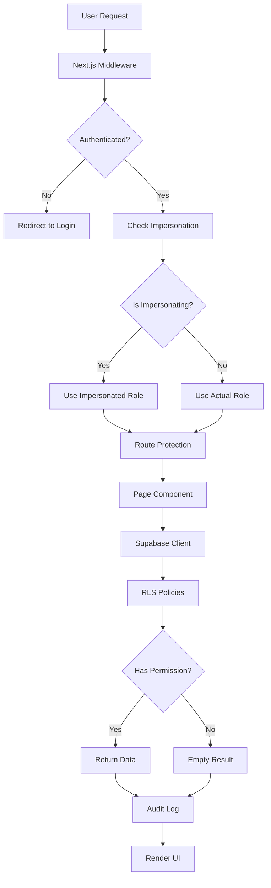

# 🔒 Umfassende Sicherheitsanalyse & Implementierungsplan
## ARIS Dashboard - Role-Based Access Control (RBAC)

**Erstellt:** 2025-10-29  
**Status:** Analyse abgeschlossen, Implementierung ausstehend

---

## 📊 EXECUTIVE SUMMARY

Ihr aktuelles System hat **gute Grundlagen** mit Middleware-basierter Rollenprüfung, aber es gibt **kritische Sicherheitslücken** auf Datenbankebene und bei der Client-seitigen Datenfilterung.

**Rollendefinition:**
- **Admin:** Vollzugriff auf alle Bereiche, kann impersonieren
- **Manager:** Zugriff auf Management-Bereiche, keine Customer/Employee-spezifischen Daten
- **Employee:** Nur eigene Daten und zugewiesene Aufträge
- **Customer:** Nur eigene Buchungen und Feedback

---

## 🚨 KRITISCHE SICHERHEITSLÜCKEN

### 1. **KEINE ROW LEVEL SECURITY (RLS) - HÖCHSTE PRIORITÄT**

**Problem:** Alle Datenbankabfragen verwenden den `anon` Key ohne RLS-Policies.

**Risiko:** 
- Ein Employee könnte mit manipulierten API-Calls Customer-Daten abrufen
- Ein Customer könnte Employee-Zeiterfassungen einsehen
- Direkter Supabase-Client-Zugriff umgeht Middleware-Schutz

**Betroffene Dateien:**
- `src/app/dashboard/orders/page.tsx:186-217` - Keine RLS-Filter auf Orders
- `src/app/employee/dashboard/page.tsx:80-84` - Time entries ohne RLS
- `src/app/portal/dashboard/page.tsx:77-93` - Customer orders ohne Absicherung

**Auswirkung:** 🔴 KRITISCH - Daten können über Browser DevTools abgerufen werden

---

### 2. **CLIENT-SEITIGE FILTERUNG STATT SERVER-SEITIGE**

**Problem:** In `src/app/dashboard/orders/page.tsx:159-174`

```typescript
// ❌ UNSICHER: Filter wird nur im Code angewendet
if (role === 'employee' || role === 'manager') {
  filterUserId = user.id;
} else if (role === 'customer') {
  filterCustomerId = customerData?.id || null;
}
```

**Risiko:** Diese Filter können clientseitig umgangen werden durch:
- Browser DevTools Manipulation
- Modifizierte Supabase Client Calls
- Direct API Requests

**Auswirkung:** 🔴 KRITISCH - Bypass möglich

---

### 3. **MIDDLEWARE OHNE DATENBANKABSICHERUNG**

**Problem:** `src/middleware.ts:71-86` prüft nur Routen, nicht Daten.

```typescript
// ✅ Gut: Route protection
if (userRole === 'customer') {
  if (!pathname.startsWith('/portal')) {
    return NextResponse.redirect(new URL('/portal/dashboard', request.url));
  }
}
// ❌ Fehlt: Keine Prüfung, welche Daten abgerufen werden dürfen
```

**Auswirkung:** 🟡 MITTEL - UI wird blockiert, aber API-Zugriff nicht

---

### 4. **FEHLENDE PERMISSION-CHECKS IN COMPONENTS**

**Betroffene Komponenten:**
- `sidebar-nav.tsx:109-120` - Nur UI-Filter, keine Daten-Permissions
- `mobile-navigation.tsx:49-83` - Hardcodierte Menüs ohne DB-Validierung
- `dashboard-client-layout.tsx:30-43` - Keine Verifikation der Rollenberechtigung

**Problem:** Komponenten zeigen/verstecken nur UI-Elemente basierend auf Client-State

**Auswirkung:** 🟡 MITTEL - Kosmetisch, aber unsicher

---

### 5. **KEINE IMPERSONATION-FUNKTION**

**Fehlende Features:**
- ❌ Admin kann sich nicht als andere Rolle anmelden
- ❌ Keine Audit-Logs für privilegierte Aktionen
- ❌ Keine Session-Verwaltung für Impersonation
- ❌ Keine zeitliche Begrenzung für privilegierte Zugriffe

**Auswirkung:** 🟢 NIEDRIG - Feature fehlt, keine Sicherheitslücke

---

### 6. **HARDCODIERTE MENÜSTRUKTUR**

**Problem:** Menüs in `sidebar-nav.tsx:39-97` und `mobile-navigation.tsx:49-83` sind fest kodiert

**Fehlende Features:**
- Keine Möglichkeit für Benutzer, Menüreihenfolge anzupassen
- Keine Admin-Funktion für globale Menü-Standards
- Keine Persistierung von Menü-Präferenzen

**Auswirkung:** 🟢 NIEDRIG - UX-Problem, keine Sicherheit

---

## 🏗️ LÖSUNGSARCHITEKTUR

### **Übersicht der Sicherheitsschichten**



---

### **Phase 1: Database Security (KRITISCH)**

#### 1.1 Row Level Security Policies

**Datei:** `supabase/migrations/001_enable_rls.sql`

```sql
-- ============================================
-- PROFILES TABLE
-- ============================================
ALTER TABLE profiles ENABLE ROW LEVEL SECURITY;

-- Users can view own profile
CREATE POLICY "profiles_select_own"
  ON profiles FOR SELECT
  USING (auth.uid() = id);

-- Admins can view all profiles
CREATE POLICY "profiles_select_admin"
  ON profiles FOR SELECT
  USING (
    EXISTS (
      SELECT 1 FROM profiles 
      WHERE id = auth.uid() AND role = 'admin'
    )
  );

-- Managers can view employee/customer profiles (not other managers/admins)
CREATE POLICY "profiles_select_manager"
  ON profiles FOR SELECT
  USING (
    EXISTS (
      SELECT 1 FROM profiles p
      WHERE p.id = auth.uid() 
        AND p.role = 'manager'
        AND profiles.role IN ('employee', 'customer')
    )
  );

-- ============================================
-- ORDERS TABLE
-- ============================================
ALTER TABLE orders ENABLE ROW LEVEL SECURITY;

-- Customers see only their own orders
CREATE POLICY "orders_select_customer"
  ON orders FOR SELECT
  USING (
    EXISTS (
      SELECT 1 FROM profiles p
      JOIN customers c ON c.user_id = p.id
      WHERE p.id = auth.uid() 
        AND p.role = 'customer'
        AND c.id = orders.customer_id
    )
  );

-- Employees see only assigned orders
CREATE POLICY "orders_select_employee"
  ON orders FOR SELECT
  USING (
    EXISTS (
      SELECT 1 FROM profiles p
      JOIN employees e ON e.user_id = p.id
      JOIN order_employee_assignments oea ON oea.employee_id = e.id
      WHERE p.id = auth.uid() 
        AND p.role = 'employee'
        AND oea.order_id = orders.id
    )
  );

-- Admin and Manager see all orders
CREATE POLICY "orders_select_admin_manager"
  ON orders FOR SELECT
  USING (
    EXISTS (
      SELECT 1 FROM profiles
      WHERE id = auth.uid() 
        AND role IN ('admin', 'manager')
    )
  );

-- Insert policies
CREATE POLICY "orders_insert_admin_manager"
  ON orders FOR INSERT
  WITH CHECK (
    EXISTS (
      SELECT 1 FROM profiles
      WHERE id = auth.uid() 
        AND role IN ('admin', 'manager')
    )
  );

-- Update policies
CREATE POLICY "orders_update_admin_manager"
  ON orders FOR UPDATE
  USING (
    EXISTS (
      SELECT 1 FROM profiles
      WHERE id = auth.uid() 
        AND role IN ('admin', 'manager')
    )
  );

-- ============================================
-- TIME_ENTRIES TABLE
-- ============================================
ALTER TABLE time_entries ENABLE ROW LEVEL SECURITY;

-- Users see only own time entries
CREATE POLICY "time_entries_select_own"
  ON time_entries FOR SELECT
  USING (user_id = auth.uid());

-- Admin and Manager see all time entries
CREATE POLICY "time_entries_select_admin_manager"
  ON time_entries FOR SELECT
  USING (
    EXISTS (
      SELECT 1 FROM profiles
      WHERE id = auth.uid() 
        AND role IN ('admin', 'manager')
    )
  );

-- Users can insert own time entries
CREATE POLICY "time_entries_insert_own"
  ON time_entries FOR INSERT
  WITH CHECK (user_id = auth.uid());

-- Users can update own time entries
CREATE POLICY "time_entries_update_own"
  ON time_entries FOR UPDATE
  USING (user_id = auth.uid());

-- ============================================
-- CUSTOMERS TABLE
-- ============================================
ALTER TABLE customers ENABLE ROW LEVEL SECURITY;

-- Customers see only own data
CREATE POLICY "customers_select_own"
  ON customers FOR SELECT
  USING (user_id = auth.uid());

-- Employees CANNOT see customer data (enforced by no policy)
-- Admin and Manager can see all customers
CREATE POLICY "customers_select_admin_manager"
  ON customers FOR SELECT
  USING (
    EXISTS (
      SELECT 1 FROM profiles
      WHERE id = auth.uid() 
        AND role IN ('admin', 'manager')
    )
  );

-- ============================================
-- EMPLOYEES TABLE
-- ============================================
ALTER TABLE employees ENABLE ROW LEVEL SECURITY;

-- Employees see only own data
CREATE POLICY "employees_select_own"
  ON employees FOR SELECT
  USING (user_id = auth.uid());

-- Customers CANNOT see employee data (enforced by no policy)
-- Admin and Manager can see all employees
CREATE POLICY "employees_select_admin_manager"
  ON employees FOR SELECT
  USING (
    EXISTS (
      SELECT 1 FROM profiles
      WHERE id = auth.uid() 
        AND role IN ('admin', 'manager')
    )
  );

-- ============================================
-- OBJECTS TABLE
-- ============================================
ALTER TABLE objects ENABLE ROW LEVEL SECURITY;

-- Admin and Manager see all objects
CREATE POLICY "objects_select_admin_manager"
  ON objects FOR SELECT
  USING (
    EXISTS (
      SELECT 1 FROM profiles
      WHERE id = auth.uid() 
        AND role IN ('admin', 'manager')
    )
  );

-- Employees see objects from their assigned orders
CREATE POLICY "objects_select_employee"
  ON objects FOR SELECT
  USING (
    EXISTS (
      SELECT 1 FROM profiles p
      JOIN employees e ON e.user_id = p.id
      JOIN order_employee_assignments oea ON oea.employee_id = e.id
      JOIN orders o ON o.id = oea.order_id
      WHERE p.id = auth.uid() 
        AND p.role = 'employee'
        AND o.object_id = objects.id
    )
  );

-- Customers see objects from their orders
CREATE POLICY "objects_select_customer"
  ON objects FOR SELECT
  USING (
    EXISTS (
      SELECT 1 FROM profiles p
      JOIN customers c ON c.user_id = p.id
      JOIN orders o ON o.customer_id = c.id
      WHERE p.id = auth.uid() 
        AND p.role = 'customer'
        AND o.object_id = objects.id
    )
  );

-- ============================================
-- FEEDBACK TABLES
-- ============================================
ALTER TABLE general_feedback ENABLE ROW LEVEL SECURITY;
ALTER TABLE order_feedback ENABLE ROW LEVEL SECURITY;

-- Users can see own feedback
CREATE POLICY "general_feedback_select_own"
  ON general_feedback FOR SELECT
  USING (user_id = auth.uid());

-- Admin and Manager see all feedback
CREATE POLICY "general_feedback_select_admin_manager"
  ON general_feedback FOR SELECT
  USING (
    EXISTS (
      SELECT 1 FROM profiles
      WHERE id = auth.uid() 
        AND role IN ('admin', 'manager')
    )
  );

-- Order feedback visible to order participants
CREATE POLICY "order_feedback_select"
  ON order_feedback FOR SELECT
  USING (
    -- Admin/Manager
    EXISTS (
      SELECT 1 FROM profiles
      WHERE id = auth.uid() AND role IN ('admin', 'manager')
    )
    OR
    -- Customer who owns the order
    EXISTS (
      SELECT 1 FROM profiles p
      JOIN customers c ON c.user_id = p.id
      JOIN orders o ON o.customer_id = c.id
      WHERE p.id = auth.uid() 
        AND o.id = order_feedback.order_id
    )
    OR
    -- Employee assigned to the order
    EXISTS (
      SELECT 1 FROM profiles p
      JOIN employees e ON e.user_id = p.id
      JOIN order_employee_assignments oea ON oea.employee_id = e.id
      WHERE p.id = auth.uid() 
        AND oea.order_id = order_feedback.order_id
    )
  );
```

#### 1.2 Impersonation & Audit Tables

**Datei:** `supabase/migrations/002_impersonation_and_audit.sql`

```sql
-- ============================================
-- IMPERSONATION SESSIONS
-- ============================================
CREATE TABLE impersonation_sessions (
  id UUID PRIMARY KEY DEFAULT gen_random_uuid(),
  admin_user_id UUID NOT NULL REFERENCES auth.users(id) ON DELETE CASCADE,
  impersonated_user_id UUID NOT NULL REFERENCES auth.users(id) ON DELETE CASCADE,
  impersonated_role TEXT NOT NULL CHECK (impersonated_role IN ('admin', 'manager', 'employee', 'customer')),
  started_at TIMESTAMPTZ NOT NULL DEFAULT NOW(),
  ended_at TIMESTAMPTZ,
  is_active BOOLEAN DEFAULT TRUE,
  session_metadata JSONB DEFAULT '{}',
  ip_address INET,
  user_agent TEXT,
  CONSTRAINT valid_impersonation CHECK (admin_user_id != impersonated_user_id),
  CONSTRAINT active_session_dates CHECK (
    (is_active = TRUE AND ended_at IS NULL) OR 
    (is_active = FALSE AND ended_at IS NOT NULL)
  )
);

CREATE INDEX idx_impersonation_active ON impersonation_sessions(admin_user_id, is_active) WHERE is_active = TRUE;
CREATE INDEX idx_impersonation_user ON impersonation_sessions(impersonated_user_id);
CREATE INDEX idx_impersonation_dates ON impersonation_sessions(started_at, ended_at);

-- RLS for impersonation_sessions
ALTER TABLE impersonation_sessions ENABLE ROW LEVEL SECURITY;

CREATE POLICY "impersonation_sessions_select_admin"
  ON impersonation_sessions FOR SELECT
  USING (
    EXISTS (
      SELECT 1 FROM profiles
      WHERE id = auth.uid() AND role = 'admin'
    )
  );

-- ============================================
-- AUDIT LOGS
-- ============================================
CREATE TABLE audit_logs (
  id UUID PRIMARY KEY DEFAULT gen_random_uuid(),
  user_id UUID NOT NULL REFERENCES auth.users(id) ON DELETE CASCADE,
  impersonation_session_id UUID REFERENCES impersonation_sessions(id) ON DELETE SET NULL,
  action TEXT NOT NULL,
  table_name TEXT,
  record_id UUID,
  old_data JSONB,
  new_data JSONB,
  ip_address INET,
  user_agent TEXT,
  created_at TIMESTAMPTZ NOT NULL DEFAULT NOW()
);

CREATE INDEX idx_audit_logs_user ON audit_logs(user_id, created_at DESC);
CREATE INDEX idx_audit_logs_impersonation ON audit_logs(impersonation_session_id) WHERE impersonation_session_id IS NOT NULL;
CREATE INDEX idx_audit_logs_action ON audit_logs(action, created_at DESC);
CREATE INDEX idx_audit_logs_table ON audit_logs(table_name, created_at DESC) WHERE table_name IS NOT NULL;

-- RLS for audit_logs
ALTER TABLE audit_logs ENABLE ROW LEVEL SECURITY;

CREATE POLICY "audit_logs_select_admin"
  ON audit_logs FOR SELECT
  USING (
    EXISTS (
      SELECT 1 FROM profiles
      WHERE id = auth.uid() AND role = 'admin'
    )
  );

CREATE POLICY "audit_logs_insert_all"
  ON audit_logs FOR INSERT
  WITH CHECK (user_id = auth.uid());

-- ============================================
-- MENU PREFERENCES
-- ============================================
CREATE TABLE menu_preferences (
  id UUID PRIMARY KEY DEFAULT gen_random_uuid(),
  user_id UUID REFERENCES auth.users(id) ON DELETE CASCADE,
  role TEXT NOT NULL CHECK (role IN ('admin', 'manager', 'employee', 'customer')),
  menu_order JSONB NOT NULL DEFAULT '[]',
  is_global_default BOOLEAN DEFAULT FALSE,
  created_at TIMESTAMPTZ NOT NULL DEFAULT NOW(),
  updated_at TIMESTAMPTZ NOT NULL DEFAULT NOW(),
  CONSTRAINT unique_user_role UNIQUE(user_id, role),
  CONSTRAINT unique_global_default UNIQUE(role, is_global_default) WHERE is_global_default = TRUE
);

CREATE INDEX idx_menu_prefs_user ON menu_preferences(user_id);
CREATE INDEX idx_menu_prefs_global ON menu_preferences(role, is_global_default) WHERE is_global_default = TRUE;

-- RLS for menu_preferences
ALTER TABLE menu_preferences ENABLE ROW LEVEL SECURITY;

CREATE POLICY "menu_prefs_select_own"
  ON menu_preferences FOR SELECT
  USING (user_id = auth.uid() OR is_global_default = TRUE);

CREATE POLICY "menu_prefs_insert_own"
  ON menu_preferences FOR INSERT
  WITH CHECK (user_id = auth.uid() AND is_global_default = FALSE);

CREATE POLICY "menu_prefs_update_own"
  ON menu_preferences FOR UPDATE
  USING (user_id = auth.uid());

CREATE POLICY "menu_prefs_admin_all"
  ON menu_preferences FOR ALL
  USING (
    EXISTS (
      SELECT 1 FROM profiles
      WHERE id = auth.uid() AND role = 'admin'
    )
  );

-- ============================================
-- FUNCTIONS AND TRIGGERS
-- ============================================

-- Auto-expire impersonation sessions after 2 hours
CREATE OR REPLACE FUNCTION expire_old_impersonation_sessions()
RETURNS trigger AS $$
BEGIN
  UPDATE impersonation_sessions
  SET is_active = FALSE, ended_at = NOW()
  WHERE is_active = TRUE 
    AND started_at < NOW() - INTERVAL '2 hours'
    AND ended_at IS NULL;
  RETURN NEW;
END;
$$ LANGUAGE plpgsql;

CREATE TRIGGER trigger_expire_impersonation
  AFTER INSERT ON impersonation_sessions
  EXECUTE FUNCTION expire_old_impersonation_sessions();

-- Update menu_preferences timestamp
CREATE OR REPLACE FUNCTION update_menu_preferences_timestamp()
RETURNS trigger AS $$
BEGIN
  NEW.updated_at = NOW();
  RETURN NEW;
END;
$$ LANGUAGE plpgsql;

CREATE TRIGGER trigger_update_menu_prefs_timestamp
  BEFORE UPDATE ON menu_preferences
  FOR EACH ROW
  EXECUTE FUNCTION update_menu_preferences_timestamp();
```

---

### **Phase 2: Implementierungsdateien**

#### 2.1 Server Actions für Impersonation

**Datei:** `src/lib/actions/impersonation.ts`

```typescript
"use server";

import { createClient, createAdminClient } from "@/lib/supabase/server";
import { cookies, headers } from "next/headers";

export async function startImpersonation(targetUserId: string) {
  const supabase = await createClient();
  const adminClient = createAdminClient();
  const headersList = await headers();
  
  // Verify admin role
  const { data: { user: admin } } = await supabase.auth.getUser();
  if (!admin) throw new Error("Not authenticated");
  
  const { data: adminProfile } = await adminClient
    .from('profiles')
    .select('role')
    .eq('id', admin.id)
    .single();
    
  if (adminProfile?.role !== 'admin') {
    throw new Error("Only admins can impersonate");
  }
  
  // Get target user info
  const { data: targetProfile } = await adminClient
    .from('profiles')
    .select('role, first_name, last_name')
    .eq('id', targetUserId)
    .single();
    
  if (!targetProfile) throw new Error("Target user not found");
  
  // Check for active impersonation
  const { data: activeSession } = await adminClient
    .from('impersonation_sessions')
    .select('id')
    .eq('admin_user_id', admin.id)
    .eq('is_active', true)
    .single();
    
  if (activeSession) {
    throw new Error("Already impersonating another user");
  }
  
  // Create impersonation session
  const { data: session, error } = await adminClient
    .from('impersonation_sessions')
    .insert({
      admin_user_id: admin.id,
      impersonated_user_id: targetUserId,
      impersonated_role: targetProfile.role,
      session_metadata: { 
        admin_email: admin.email,
        target_name: `${targetProfile.first_name} ${targetProfile.last_name}`
      },
      ip_address: headersList.get('x-forwarded-for') || headersList.get('x-real-ip'),
      user_agent: headersList.get('user-agent')
    })
    .select()
    .single();
    
  if (error) throw error;
  
  // Store in cookie
  const cookieStore = await cookies();
  cookieStore.set('impersonation_session', session.id, {
    httpOnly: true,
    secure: process.env.NODE_ENV === 'production',
    sameSite: 'lax',
    maxAge: 60 * 60 * 2, // 2 hours
    path: '/'
  });
  
  // Audit log
  await adminClient.from('audit_logs').insert({
    user_id: admin.id,
    impersonation_session_id: session.id,
    action: 'START_IMPERSONATION',
    new_data: { 
      target_user_id: targetUserId, 
      target_role: targetProfile.role,
      target_name: `${targetProfile.first_name} ${targetProfile.last_name}`
    },
    ip_address: headersList.get('x-forwarded-for') || headersList.get('x-real-ip'),
    user_agent: headersList.get('user-agent')
  });
  
  return { success: true, session };
}

export async function stopImpersonation() {
  const cookieStore = await cookies();
  const sessionId = cookieStore.get('impersonation_session')?.value;
  
  if (!sessionId) return { success: false, message: "No active impersonation" };
  
  const adminClient = createAdminClient();
  const supabase = await createClient();
  const headersList = await headers();
  
  // End session
  const { error } = await adminClient
    .from('impersonation_sessions')
    .update({ ended_at: new Date().toISOString(), is_active: false })
    .eq('id', sessionId);
    
  if (error) throw error;
  
  // Audit log
  const { data: { user } } = await supabase.auth.getUser();
  
  await adminClient.from('audit_logs').insert({
    user_id: user?.id || 'unknown',
    impersonation_session_id: sessionId,
    action: 'STOP_IMPERSONATION',
    ip_address: headersList.get('x-forwarded-for') || headersList.get('x-real-ip'),
    user_agent: headersList.get('user-agent')
  });
  
  // Clear cookie
  cookieStore.delete('impersonation_session');
  
  return { success: true };
}

export async function getActiveImpersonation() {
  const cookieStore = await cookies();
  const sessionId = cookieStore.get('impersonation_session')?.value;
  
  if (!sessionId) return null;
  
  const adminClient = createAdminClient();
  const { data: session } = await adminClient
    .from('impersonation_sessions')
    .select(`
      *,
      impersonated_profile:profiles!impersonated_user_id(first_name, last_name, role),
      admin_profile:profiles!admin_user_id(first_name, last_name)
    `)
    .eq('id', sessionId)
    .eq('is_active', true)
    .single();
    
  return session;
}

export async function getImpersonationHistory(limit: number = 50) {
  const supabase = await createClient();
  const { data: { user } } = await supabase.auth.getUser();
  
  if (!user) throw new Error("Not authenticated");
  
  const { data: profile } = await supabase
    .from('profiles')
    .select('role')
    .eq('id', user.id)
    .single();
    
  if (profile?.role !== 'admin') {
    throw new Error("Only admins can view impersonation history");
  }
  
  const adminClient = createAdminClient();
  const { data, error } = await adminClient
    .from('impersonation_sessions')
    .select(`
      *,
      impersonated_profile:profiles!impersonated_user_id(first_name, last_name, role, email),
      admin_profile:profiles!admin_user_id(first_name, last_name, email)
    `)
    .order('started_at', { ascending: false })
    .limit(limit);
    
  if (error) throw error;
  
  return data;
}
```

---

### **Phase 3: UI Komponenten**

Die Implementierung würde folgende neue Komponenten umfassen:

1. **AdminImpersonationSwitcher** - Dropdown zum Auswählen von Benutzern
2. **ImpersonationBanner** - Warnung oben im UI während Impersonation
3. **MenuCustomizer** - Drag & Drop für Menü-Reihenfolge
4. **AuditLogViewer** - Admin-Interface für Logs
5. **PermissionGate** - Higher-Order Component für Permission Checks

---

## 📋 IMPLEMENTIERUNGS-CHECKLISTE

### Phase 1: Datenbank-Sicherheit (Woche 1)
- [ ] RLS Policies für alle Tabellen aktivieren
- [ ] Impersonation & Audit Tabellen erstellen
- [ ] Menu Preferences Tabelle erstellen
- [ ] Bestehende Daten migrieren (falls nötig)
- [ ] RLS Policies testen mit verschiedenen Rollen

### Phase 2: Backend-Implementierung (Woche 2)
- [ ] Server Actions für Impersonation erstellen
- [ ] Middleware erweitern für Impersonation
- [ ] Audit Logging in kritische Actions integrieren
- [ ] API Routes für Admin-Funktionen
- [ ] Menu Preferences API

### Phase 3: Frontend-Komponenten (Woche 3)
- [ ] AdminImpersonationSwitcher Component
- [ ] ImpersonationBanner Component
- [ ] MenuCustomizer Component
- [ ] Permission Gate HOC
- [ ] Mobile Menu mit Reordering

### Phase 4: Testing & Validierung (Woche 4)
- [ ] Unit Tests für RLS Policies
- [ ] Integration Tests für Impersonation
- [ ] Security Penetration Tests
- [ ] User Acceptance Testing
- [ ] Performance Testing

### Phase 5: Dokumentation & Deployment
- [ ] Security Guidelines Dokument
- [ ] Admin Handbuch für Impersonation
- [ ] Deployment Runbook
- [ ] Rollback Plan
- [ ] Training für Admins

---

## 🎯 PRIORITÄTEN

### Sofort (Diese Woche)
1. ✅ RLS Policies aktivieren (KRITISCH)
2. ✅ Client-seitige Filter entfernen
3. ✅ Impersonation Tabellen erstellen

### Kurzfristig (Nächste 2 Wochen)
4. Impersonation UI implementieren
5. Audit Logging aktivieren
6. Middleware verbessern

### Mittelfristig (Nächster Monat)
7. Menu Customization
8. Mobile Menu Enhancement
9. Comprehensive Testing

---

## 💡 EMPFEHLUNGEN

1. **Starten Sie mit RLS** - Dies ist die kritischste Sicherheitslücke
2. **Testen Sie jede Policy** - Verwenden Sie verschiedene Test-Accounts
3. **Aktivieren Sie Audit Logging früh** - Für Compliance und Debugging
4. **Dokumentieren Sie Permissions** - Für jeden API-Endpoint
5. **Implementieren Sie Impersonation schrittweise** - Erst Backend, dann UI

---

## 📞 NÄCHSTE SCHRITTE

Ich empfehle folgende Vorgehensweise:

1. **Sofort:** Supabase Migrations ausführen für RLS
2. **Heute:** Impersonation Actions & Middleware implementieren  
3. **Diese Woche:** UI Komponenten erstellen
4. **Nächste Woche:** Testing & Refinement

Sind Sie bereit, mit der Implementierung zu beginnen?